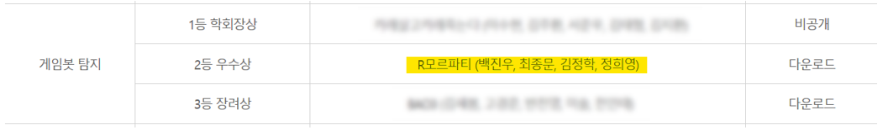

# 정보보호 R&D 데이터챌린지 2019 Game-bot-detection
고려대학교 해킹대응기술실의 MMORPG 아이온 데이터를 이용해서 Game bot을 탐지하는 프로젝트  
MMORPG와 같은 온라인 게임에서 게임 내 재화, 아이템의 환금성을 악용하여 대량의 캐릭터를 운용하여 수입을 얻는 “작업장”은 게임 밸런스를 해치고 게임 회사와 일반 이용자에게 큰 피해를 주고 있습니다. 작업장에서 이용하는 게임봇은 환금성이 있는 재화나 아이템을 채굴하기 위해 특정 행위를 반복하는 경우가 많습니다.
  

### 최종 결과
R모르파티 2등 우수상 수상

### 발표자료 및 수상내역
https://www.kisis.or.kr/kisis/subIndex/282.do

### 대회 일정
* 예선 : 2019년 10월 1일 ~ 11월 10일
* 본선 : 2019년 11월 22일 

### 예선 데이터셋
* AION 게임로그 : 15일치의 게임 로그(2010.04.16~2010.04.30)
* 일반유저/게임봇 계정 목록 : 로그에 포함된 일부 유저 계정의 실제 클래스 (일반유저 7500개, 게임봇 600개)
* 제출용 계정 목록 : 분석결과를 제출해야 하는 유저 계정 목록 (8236개)

### 본선 데이터셋
* AION 게임 로그 : 약 7일치의 게임 로그 (2010.05. 중)
* 제출용 계정 목록 : 분석결과를 제출해야 하는 유저 계정 목록만 제공
* 사전 배포 : 로그 특성 상 전처리 시간이 오래 걸리는 점을 감안하여, 진출팀에게 본선 1~2일 전 미리 배포

### 분석 툴
* Google Cloud Platform
* Python

### 모델
* CatBoost
* XGBoost
* Random Forest

### 팀원
* 백진우(연세대학교 컴퓨터과학과)
* 최종문(연세대학교 응용통계학과)
* 김정학(연세대학교 컴퓨터과학과)
* 정희영(연세대학교 응용통계학과)
